# Language Games

Dead simple semantic word games powered by word vectors, played in the terminal.

Uses [GloVe](https://nlp.stanford.edu/projects/glove/) vectors from Stanford NLP with a lightweight pure-numpy backend — no heavy ML frameworks needed. Models download automatically on first run and are cached for instant reloading.


## Games

| # | Game | How it works |
|---|------|-------------|
| 1 | **Competitive Guessing** | A secret word is chosen. Semantic hints are shown. Guess the word — cosine similarity is your score. |
| 2 | **Closest Word** | Pick the word from a list that is most similar to a target. |
| 3 | **Odd One Out** | Find the word that doesn't belong in a group. |
| 4 | **Semantic Scrabble** | Form words from random letter tiles that are semantically close to a target. |
| 5 | **Analogies** | *A is to B as C is to ???* — classic word-vector arithmetic. |
| 6 | **Word Chain** | Build a chain of related words. Break the chain and lose a life. |
| 7 | **Hot & Cold** | Guess the secret word guided by a temperature meter — hotter means closer. |
| 8 | **Category Sprint** | Name as many words as you can that belong to a category. |

All games support any number of players and three difficulty levels (easy / medium / hard). A session leaderboard tracks wins across games.

## Install

```bash
uv venv .venv && source .venv/bin/activate && uv pip install -r requirements.txt
```

Or with pip:

```bash
python3 -m venv .venv && source .venv/bin/activate && pip install -r requirements.txt
```

## Run

```bash
python play_game.py
```

On first launch you choose a vector dimensionality (50d–300d). The GloVe zip (~822 MB) downloads once with a progress bar and is cached in `~/.cache/language-games/`.

## Features

- **Animated TUI** — similarity bars fill up in real-time, countdowns before reveals, winner celebrations
- **Temperature meter** — the Hot & Cold game shows a thermometer from Frozen to ON FIRE!
- **Letter tiles** — Semantic Scrabble renders Scrabble-style tiles
- **Session leaderboard** — tracks wins across games in a single session
- **Difficulty levels** — affects similarity thresholds, number of hints, and guess limits
- **Topic filtering** — optionally restrict the word pool to a semantic topic
- **Zero compilation** — pure numpy backend, works on any Python 3.10+

## Screenshots

### Title & Model Selection
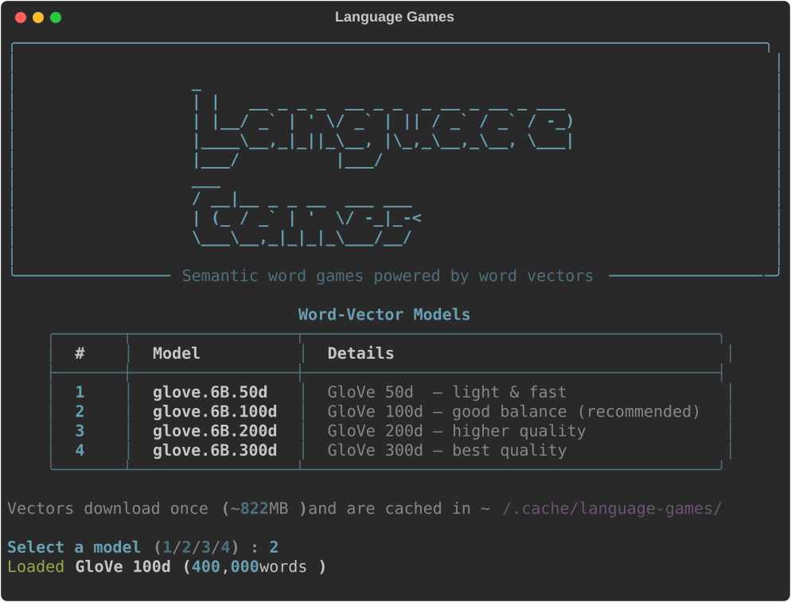

### Game Menu
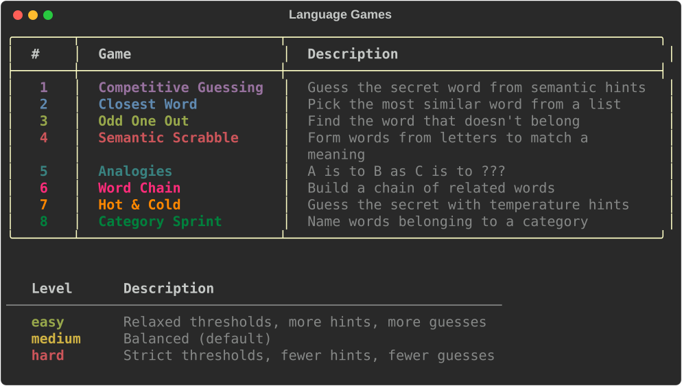

### Game 1 — Competitive Guessing
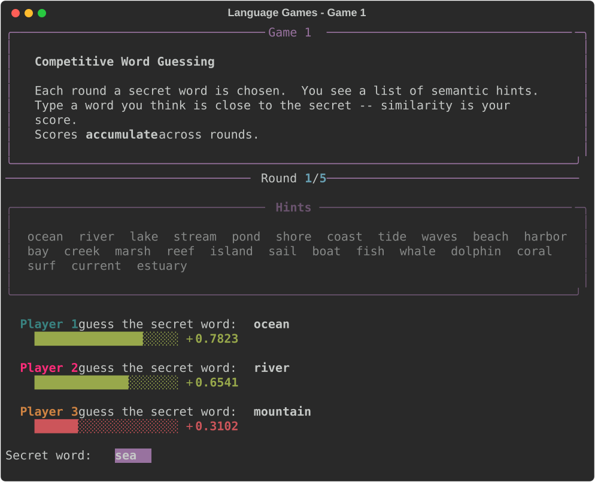

### Game 2 — Closest Word
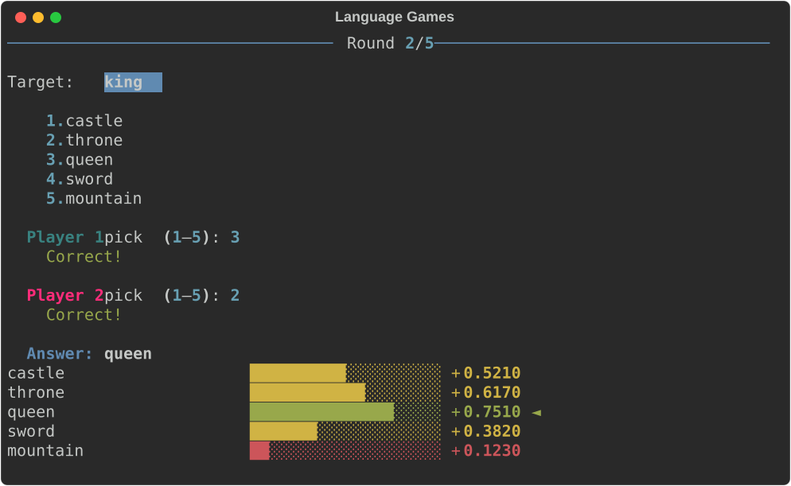

### Game 3 — Odd One Out
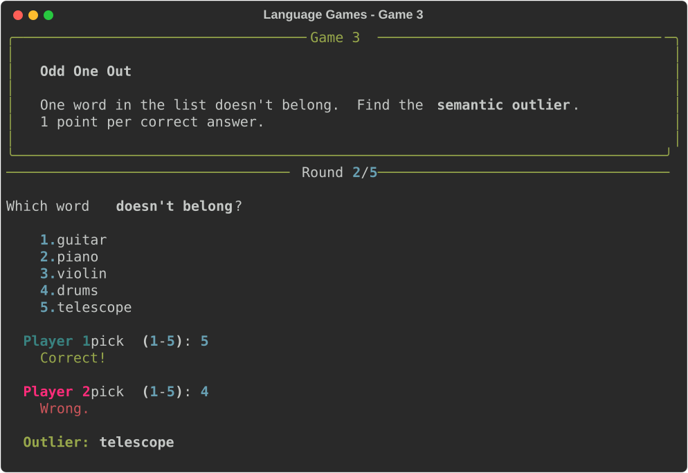

### Game 4 — Semantic Scrabble
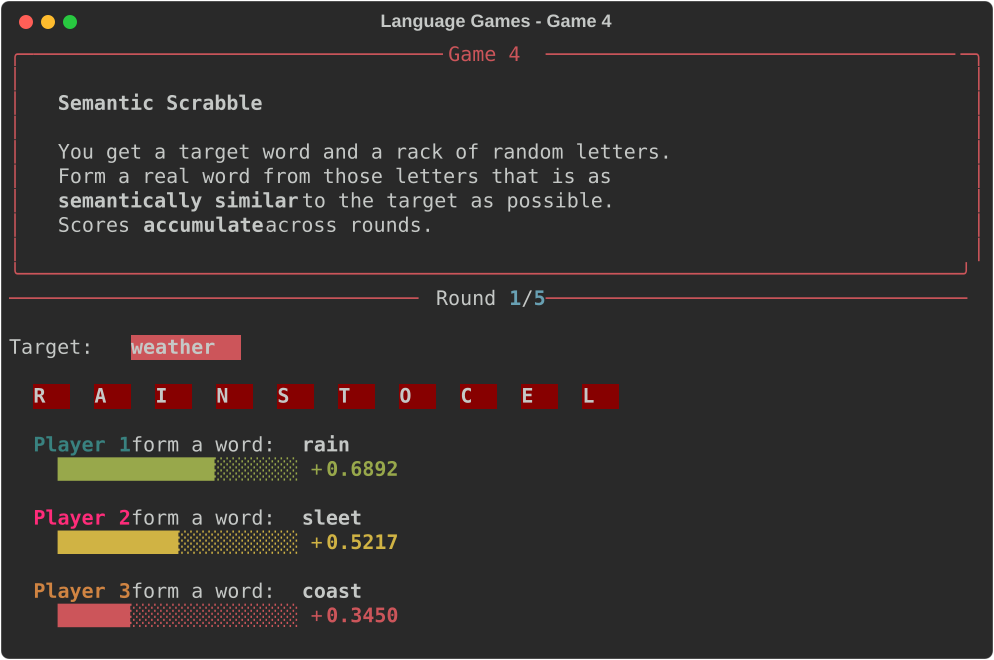

### Game 5 — Analogies
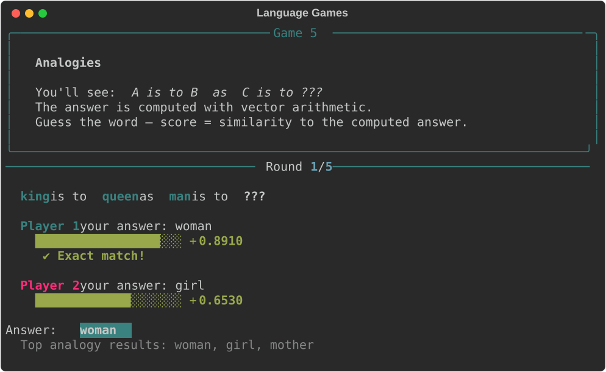

### Game 6 — Word Chain
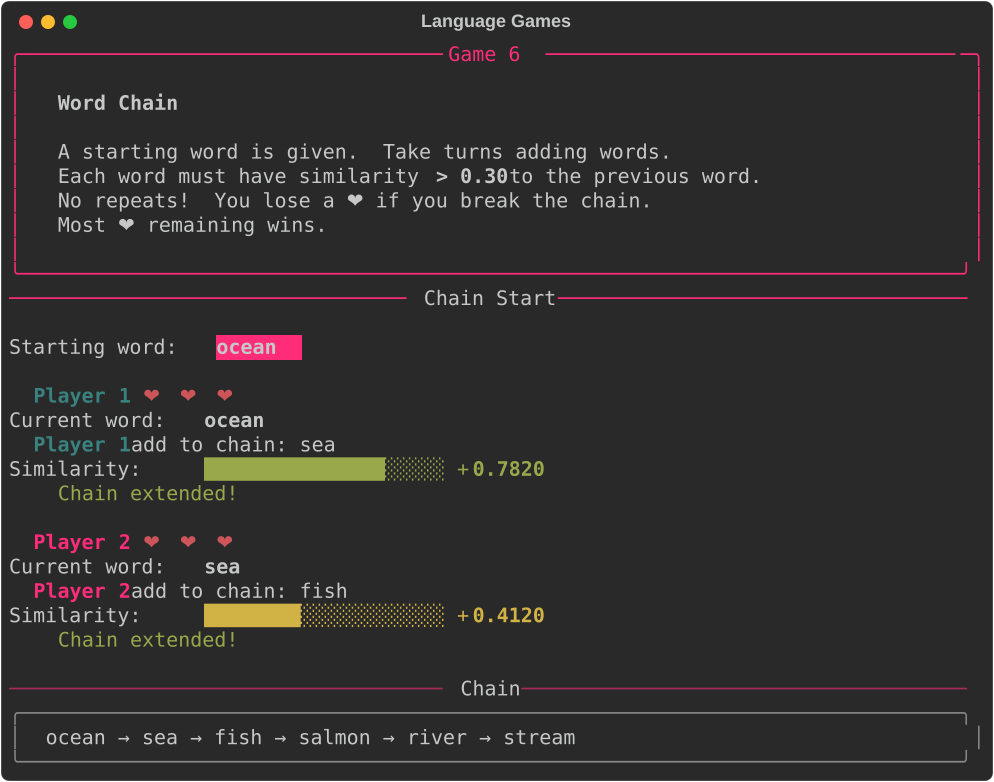

### Game 7 — Hot & Cold
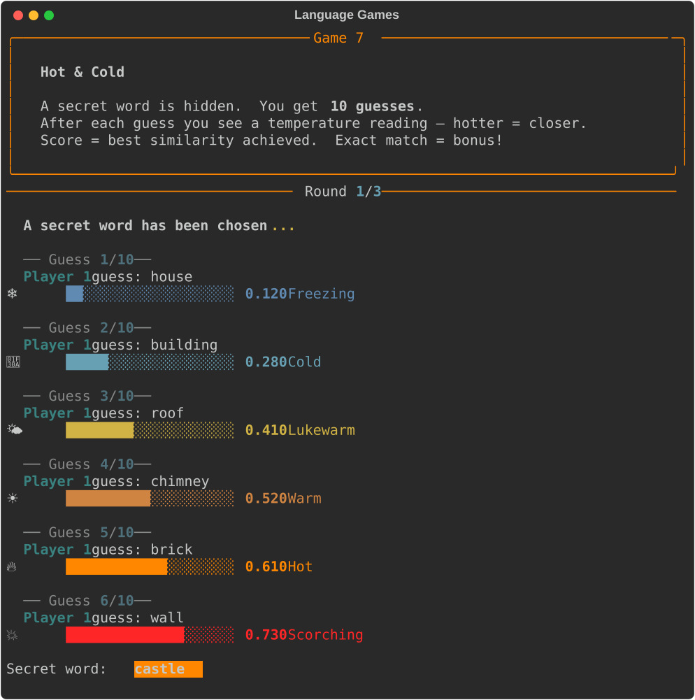

### Game 8 — Category Sprint
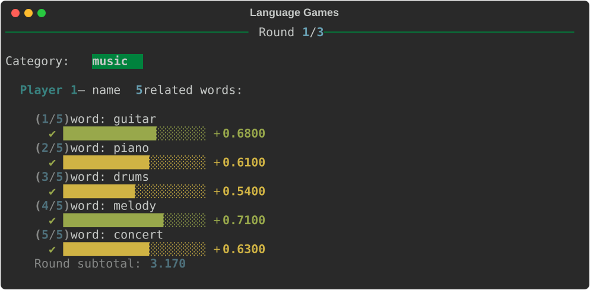

### Final Scores & Session Leaderboard
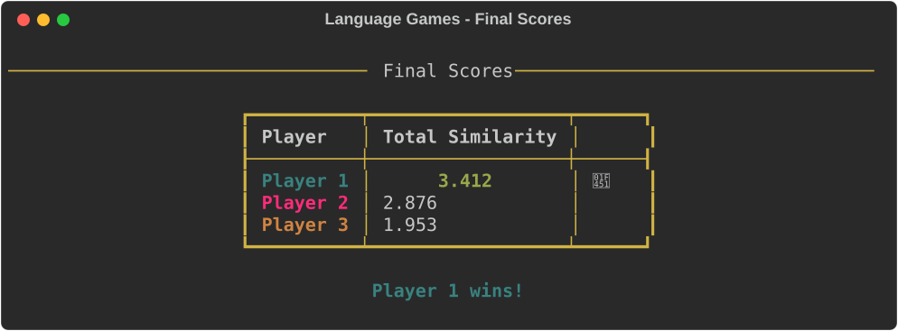

## How It Works

Words are represented as dense vectors in a high-dimensional space (50–300 dimensions) where semantically similar words are closer together.

The `WordVectors` class is a lightweight, pure-numpy implementation that supports:
- **Cosine similarity** between any two words
- **Most-similar lookup** using fast `argpartition`
- **Outlier detection** by distance from group centroid
- **Vector arithmetic** for analogies (`king - man + woman = queen`)

## Dependencies

Just `numpy` and `rich`.

## License

MIT
